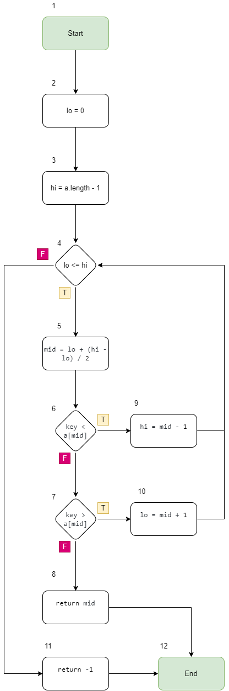
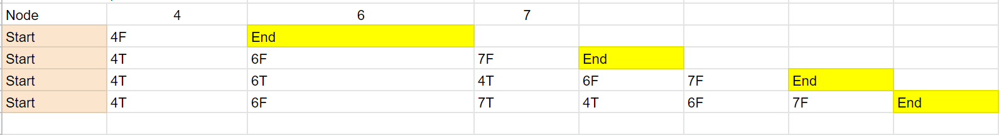
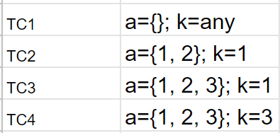
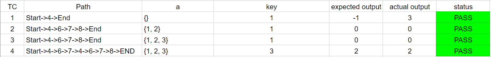
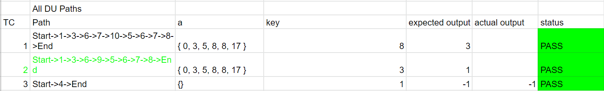

This module test by 2 techniques, which are Control Flow Graph with MCC Coverage and Data Flow Graph with All DU-Paths Coverage

* Control Flow Graph with MCC

Test cases:

* Data Flow Graph with All DU-Paths Coverage
Graph:

Testcase:

